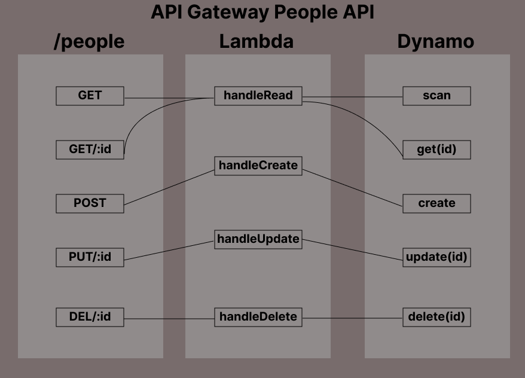

# serverless-api (LAB 18)

## Project: Deploy to AWS

### Author: Tyler Bennett

### Problem Domain  

Create an API using API Gateway

### Links and Resources

- [back-end server GUI deployed](https://fxyxdqmig0.execute-api.us-east-1.amazonaws.com/Lab18/people)

The above link will automatically take you to the People route. The people object expects 3 properties: age(integer), id(string), and name(string).

#### Features / Routes

/People - GET, GET/:id, POST, PUT/:id, DELETE/:id

#### UML

